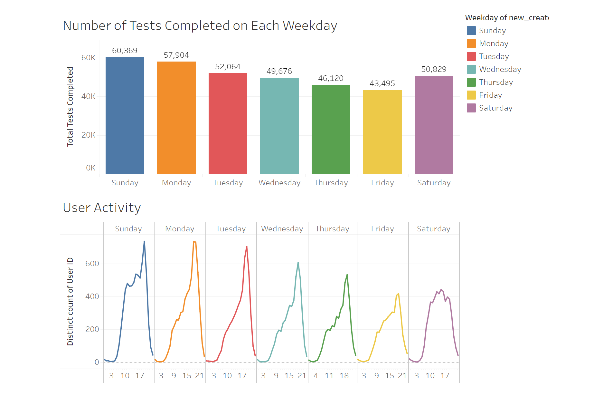
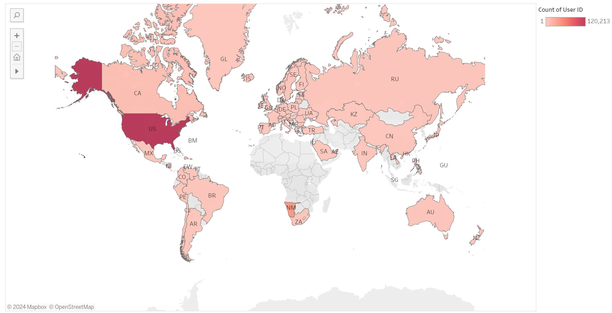

Check out the projects I've been working on!

## Tableau Visualization: Business Analysis for Dognition

Updated Mar.2024

[Dognition](https://www.dognition.com/) is a company that offers online games and assessments designed to help dog owners better understand their pet's behavior and cognition. In this project, I investigated the reason behind drop-offs after the completion of each game, created visualizations using calculation fields and table calculations from multiple blend data sources, and presented my solutions using dashboards and story.

* [Screencast](https://youtu.be/4MPAo26Lyy4)
* [Tableau Pubic Viz](https://public.tableau.com/app/profile/sitian.zhou/viz/coursera_week3_quiz/DognitionAnalysis?publish=yes)
* Sample plots

## Heart Disease Prediction 

**Programming language used: SAS**

Updated Feb. 2024

In this project, I delved into the relationship between physical conditions and the onset of coronary heart disease through the application of three logistic models. Leveraging SAS alongside DATA Step, MACRO, SQL, and various PROC steps, I conducted comprehensive analyses. Additionally, I assessed each model's efficacy using ROC curves, ultimately identifying the most effective one. Notably, my investigation underscored systolic blood pressure and glucose level as pivotal factors in predicting coronary heart disease.

* [GitHub repo](https://github.com/SitianZhou/CHD_prediction)

## Data Analysis: Decoding the World’s Richest

**Programming language used: R**

Updated Dec. 2023

In this group project, my teammates and I delved into the fluctuation of billionaires' net worth over the past decade, correlating it with shifts in global GDP. Employing our skills in data cleaning, manipulation, visualization, interactive dashboard creation, and statistical analysis, we successfully unearthed intriguing patterns. Notable findings included revealing wealth disparities between female and male billionaires, as well as observing a significant drop in net worth during the pandemic.

* [Website](https://sitianzhou.github.io/BillionaireOmics/)
* [GitHub repo](https://github.com/SitianZhou/BillionaireOmics)
